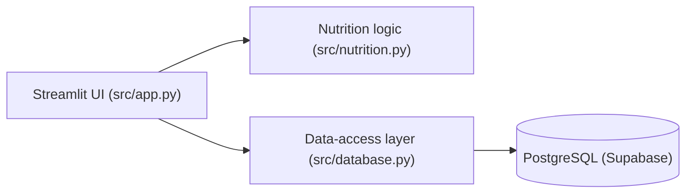

# FitStack Macro Tracker

[](https://github.com/yuranb/FitStack-Macro-Tracker/actions/workflows/ci.yml)

A Streamlit + PostgreSQL nutrition tracker with a tested data-access layer, PostgreSQL integration tests, Playwright E2E tests and CI.

## Background

Originally built as the final project for BYU's Database Modeling course, then refactored with a tested data-access layer, integration and end-to-end tests, and CI.

## Engineering Highlights

- Data-access layer (`src/database.py`) and pure nutrition math (`src/nutrition.py`) are separated from the Streamlit UI, so both can be tested directly
- 61 tests — 58 unit + integration tests (the integration suite runs against real PostgreSQL) plus 3 Playwright E2E tests; `src/nutrition.py` and `src/database.py` at 100% coverage
- GitHub Actions CI runs the suite on a PostgreSQL 16 service container and builds the Docker image on every push
- 3-table normalized schema with foreign keys, `ON DELETE CASCADE`, and indexes
- Cache-aside caching through Streamlit's `@st.cache_data`

## Architecture



## What It Does

**Core Features:**
- Log daily food intake with portion sizes
- Real-time calculation of calories, protein, carbs, and fat
- Set and track daily nutritional goals
- View 7-day intake trends with charts

## Database Design

Built around three relational tables in PostgreSQL:

**products** → **daily_logs** ← **user_goals**

- `products`: Food/supplement nutritional data (24 items pre-loaded)
- `daily_logs`: Daily intake records (foreign key to products)
- `user_goals`: User's daily nutritional targets

**Key design choices:**
- Foreign key constraint with `ON DELETE CASCADE`
- Indexes on `log_date` and `product_id` for query optimization
- `DECIMAL` type for nutritional values (precision matters)

## Caching Strategy (Cache-Aside)

Implemented using Streamlit's `@st.cache_data` decorator:

```python
@st.cache_data(ttl=300)  # 5 min TTL
def get_foods():
    # Products rarely change, safe to cache

@st.cache_data(ttl=60)   # 1 min TTL
def get_goals():
    # Goals might be updated more frequently

def get_todays_logs(date):
    # NOT cached - logs change throughout the day
```

**Purpose:** Reduce database read load by caching static/semi-static data.

## Tech Stack

- **Frontend:** Streamlit (Python)
- **Database:** Supabase (hosted PostgreSQL)
- **Visualization:** Plotly
- **Caching:** Streamlit cache layer

## Running the App

```bash
# Install dependencies
py -m pip install -r requirements.txt

# Configure .streamlit/secrets.toml with your Supabase credentials
# Run schema.sql in Supabase SQL Editor
# Start app
py -m streamlit run src/app.py
```

### Docker

A `Dockerfile` is provided (python:3.12-slim). Credentials are passed as env
vars instead of secrets.toml (`src/app.py` checks `SUPABASE_URL` /
`SUPABASE_KEY` first):

```bash
docker build -t fitstack-macro-tracker .
docker run -p 8501:8501 \
    -e SUPABASE_URL=https://your-project.supabase.co \
    -e SUPABASE_KEY=your-anon-key \
    fitstack-macro-tracker
```

## Testing

The data layer (`src/database.py`) and the pure nutrition math
(`src/nutrition.py`) are separated from the Streamlit UI so they can be
tested directly. Test layout:

| File | Tests | What it covers |
|---|---|---|
| `tests/test_nutrition.py` | 15 | per-100g scaling, aggregation, malformed rows |
| `tests/test_goal_progress.py` | 7 | goal % (cap at 100, zero/negative goals) |
| `tests/test_weekly_trend.py` | 8 | 7-day bucketing, zero-fill, out-of-range logs |
| `tests/test_database_unit.py` | 14 | data-access functions vs an in-memory fake client |
| `tests/test_database_integration.py` | 14 | same functions vs a real PostgreSQL |
| `tests/e2e/test_app_flows.py` | 3 | Playwright: record meal, macros update, trend chart |

**61 tests total.** The integration tests run the production data-access
functions against vanilla PostgreSQL using `docx/schema.sql` (seed data
included), through a small psycopg adapter
(`tests/postgres_client.py`) that speaks the same query-builder API as
supabase-py.

```bash
py -m pip install -r requirements-dev.txt

# unit + integration with coverage (integration tests need PostgreSQL:
# set DATABASE_URL, or rely on the bundled pgserver package locally)
python -m pytest tests --ignore=tests/e2e --cov=src --cov-report=term

# E2E (one-time: playwright install chromium)
python -m pytest tests/e2e --browser chromium

# everything
python -m pytest
```

The E2E tests launch the real Streamlit app against a local in-memory
PostgREST stub (`tests/e2e/postgrest_stub.py`) - no Supabase account or
network access needed.

Latest local run (Python 3.12, macOS arm64): **58 passed** for unit +
integration (`--cov=src`), plus **3 passed** E2E. Coverage:
`src/nutrition.py` 100%, `src/database.py` 100%, `src/app.py` 0% (pure
Streamlit UI, intentionally not unit-tested) - **28% of src/ lines**.
CI runs the same suite on every push (GitHub Actions with a PostgreSQL 16
service container and a coverage report in the job summary).

## Database Schema

```sql
CREATE TABLE products (
    id SERIAL PRIMARY KEY,
    name VARCHAR(100) NOT NULL UNIQUE,
    calories DECIMAL(8,2),
    protein DECIMAL(8,2),
    carbs DECIMAL(8,2),
    fat DECIMAL(8,2),
    serving_unit VARCHAR(20)
);

CREATE TABLE daily_logs (
    id SERIAL PRIMARY KEY,
    product_id INTEGER REFERENCES products(id) ON DELETE CASCADE,
    quantity DECIMAL(8,2),
    log_date DATE
);

CREATE INDEX idx_daily_logs_date ON daily_logs(log_date);
CREATE INDEX idx_daily_logs_product ON daily_logs(product_id);
```

## Project Structure

```
├── docx/schema.sql       # Database schema + seed data
├── src/app.py            # Streamlit UI (caching, error display, layout)
├── src/database.py       # Data-access functions (client injected as argument)
├── src/nutrition.py      # Pure nutrition math and aggregation
├── tests/                # pytest unit + integration + Playwright E2E
├── .github/workflows/    # CI: postgres service container + coverage
├── Dockerfile            # Container image for the app
├── requirements.txt      # Python dependencies
└── progress_log.md       # Development log
```

## Design Decisions

**Database concepts:**
- Relational database design with foreign keys
- Query optimization with indexes
- Trade-offs between normalization and query complexity

**Caching:**
- When to cache (static data) vs. when not to (dynamic data)
- TTL considerations based on data volatility
- Cache invalidation strategies

**Full-stack development:**
- Complete CRUD operations
- Input validation and error handling
- Connecting frontend to PostgreSQL backend
